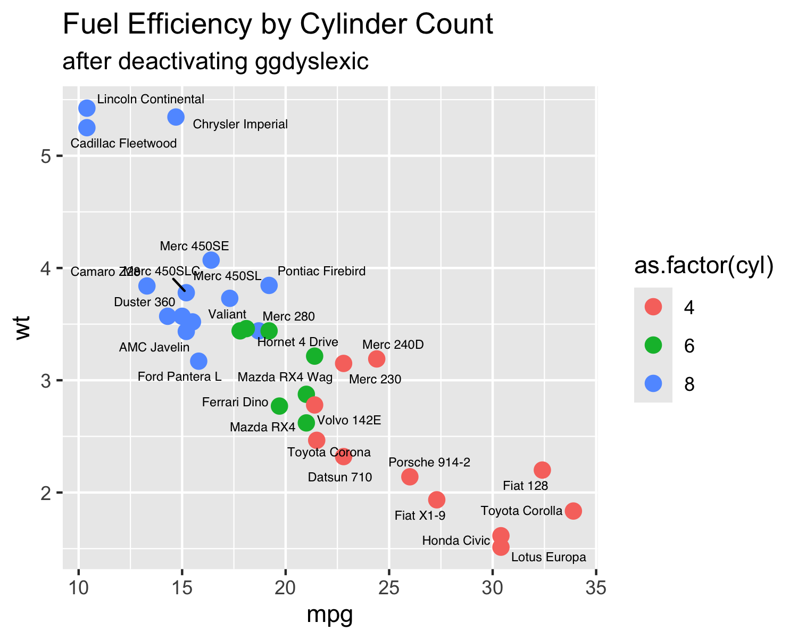
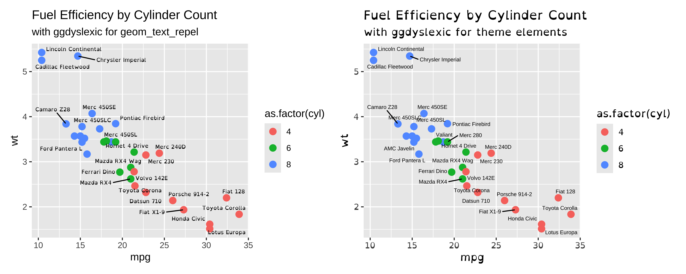

# ggdyslexic 

`ggdyslexic` is a tiny R package to make `ggplot2` more visually accessible via the [**OpenDyslexic**](https://opendyslexic.org/) font.

## Installation

```r
# install.packages("devtools")
devtools::install_github("smorabit/ggdyslexic")
```

## Using ggdyslexic

To globally initialize the OpenDyslexic font for all ggplots, simply run `use_dyslexic()`. 

```r 
library(ggplot2)
library(ggrepel)
library(patchwork)
library(ggdyslexic)

# globally activate the OpenDyslexic font (only need to run once per session)
use_dyslexic(active = TRUE)

# create a ggplot
p <- ggplot(mtcars, aes(mpg, wt, color = as.factor(cyl))) +
    geom_point(size = 3) +
    ggrepel::geom_text_repel(label = rownames(mtcars), size=2, color='black') + 
    labs(title = "Fuel Efficiency by Cylinder Count",
        subtitle = "with ggdyslexic") 

print(p)
```


To deactivate dyslexic plots, simply run `use_dyslexic(active = FALSE)`. With this approach, there is need to re-make the ggplot.

```r
# deactivate dyslexic font
use_dyslexic(active = FALSE)
print(p)
```



For further control over the fonts, you can explicitly set the theme and geom elements separately. We can run `use_dyslexic(active = FALSE, load_font = TRUE)` to load the OpenDyslexic font but not activate it globally.

```r
# load the OpenDyslexic font, but don't activate it globally
use_dyslexic(active = FALSE, load_font = TRUE)

# create a ggplot with OpenDyslexic as the geom_text_repel font
p1 <- ggplot(mtcars, aes(mpg, wt, color = as.factor(cyl))) +
    geom_point(size = 3) +
    ggrepel::geom_text_repel(
        label = rownames(mtcars), 
        size=2, color='black', 
        family = 'OpenDyslexic') + 
    labs(title = "Fuel Efficiency by Cylinder Count",
        subtitle = "with ggdyslexic for geom_text_repel") 

# create a ggplot with OpenDyslexic as the theme font
p2 <- ggplot(mtcars, aes(mpg, wt, color = as.factor(cyl))) +
    geom_point(size = 3) +
    ggrepel::geom_text_repel(
        label = rownames(mtcars), 
        size=2, color='black') + 
    labs(title = "Fuel Efficiency by Cylinder Count",
        subtitle = "with ggdyslexic for theme elements") +
    theme(text = element_text(family = 'OpenDyslexic'))

print(p1 + p2)

```


